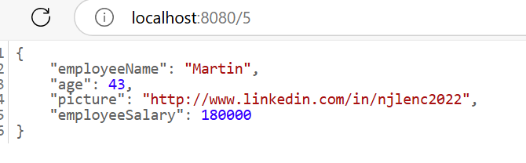
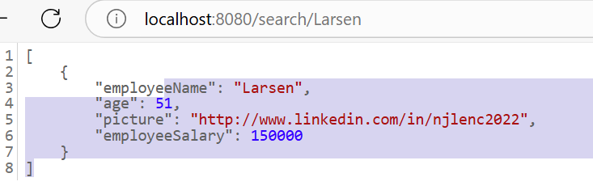

# Implementation notes/Installation

Test Submission for michael larsen.

In order to get this to run, you will need to integrate the H2 database.
The dependencies have been added to the gradle build script so 'gradle build' 
should retrieve everything necessary. After running the service, the database 
should be available. The console runs at http://localhost:8080/h2-console/login.do 
with sa/password as username/password.  Create the table EMPLOYEES first by copying the contents of src/main/resources/empoyees.ddl into console and running it. THe table should appear to the left. 
Next, load the test data by copying the contents of  src/main/resources/data.sql into
the console and running that too.  Now the database should be ready for use.

* The Service must be running in order to access the database - H2 is not very 
* robust but was a good replacement for the backend server. *

Thank you - call me if you have any trouble. 

# Weaknesses

- the current implementation does not allow searching with partial words. 
For example:

but should this only be partially specififed:

There is an index on the employees table that disallows adding records with 
duplicate names, but partial searches are not supported as they were not specified
  (e.g. should wildcards be supported, etc.)
- when creating a new employee, I avoided using a BLOB to store the bytes of a picture -
the attribute is intended to support a URL which a client app can retrieve. 
- When H2 is started in-process and the console is accessed, an error upon retrieval of 
'favicon.jpg' appears. This is why the db and application ports are identical, which 
seems to mix some requests up. The functionality is controlled in the server.port setting 
in the configuration and setup for the application in src/main/resources/application.properties.
If set to a different port than that of the microservice this error should disappear, but 
I have not had time to test this yet. 

* Tests

http://localhost:8080/

http://localhost:8080/5

http://localhost:8080/search/Larsen

http://localhost:8080/topTenHighestEarningEmployeeNames

http://localhost:8080/highestSalary

The create method was done with SoapUI so as to create the correct RequestBody.
I verified and the entry was created after I changed the DDL to AUTO-INCREMENT (a H2 feature).

The delete method returned constantly:

[nio-8080-exec-1] .w.s.m.s.DefaultHandlerExceptionResolver : Resolved [org.springframework.web.HttpRequestMethodNotSupportedException: Request method 'DELETE' not supported]

As I was required to implement 5 of the Rest endpoints, I hope the submission is acceptable.

---------------------------------
# Coding Challenge

### In this assessment you will be tasked with filling out the functionality of different methods that will be listed further down.
These methods will require some level of api interactions with the following base url: https://dummy.restapiexample.com.
Please keep the following in mind when doing this assessment: clean coding practices, test driven development, logging, and scalability.
If you are unable to successfully receive responses from the endpoints, mocking the response calls may prove to be helpful.

### Endpoints to implement

getAllEmployees()

    output - list of employees
    description - this should return all employees

getEmployeesByNameSearch()

    output - list of employees
    description - this should return all employees whose name contains or matches the string input provided

getEmployeeById(string id)

    output - employee
    description - this should return a single employee

getHighestSalaryOfEmployees()

    output - integer of the highest salary
    description -  this should return a single integer indicating the highest salary of all employees

getTop10HighestEarningEmployeeNames()

    output - list of employees
    description -  this should return a list of the top 10 employees based off of their salaries

createEmployee(string name, string salary, string age)

    output - string of the status (i.e. success)
    description -  this should return a status of success or failed based on if an employee was created

deleteEmployee(String id)

    output - the name of the employee that was deleted
    description - this should delete the employee with specified id given

### External endpoints from base url
#### This section will outline all available endpoints and their request and response models from https://dummy.restapiexample.com
/employees

    request:
        method: GET
        parameters: n/a
        full route: https://dummy.restapiexample.com/api/v1/employees
    response:
        {
            "status": "success",
            "data": [
                {
                "id": "1",
                "employee_name": "Tiger Nixon",
                "employee_salary": "320800",
                "employee_age": "61",
                "profile_image": ""
                },
                ....
            ]
        }

/employee/{id}

    request:
        method: GET
        x`parameters: 
            id (String)
        full route: https://dummy.restapiexample.com/api/v1/employee/{id}
    response: 
        {
            "status": "success",
            "data": {
                "id": "1",
                "employee_name": "Foo Bar",
                "employee_salary": "320800",
                "employee_age": "61",
                "profile_image": ""
            }
        }

/create

    request:
        method: POST
        parameters: 
            name (String),
            salary (String),
            age (String)
        full route: https://dummy.restapiexample.com/api/v1/create
    response:
        {
            "status": "success",
            "data": {
                "name": "test",
                "salary": "123",
                "age": "23",
                "id": 25
            }
        }

/delete/{id}

    request:
        method: DELETE
        parameters:
            id (String)
        full route: https://dummy.restapiexample.com/api/v1/delete/{id}
    response:
        {
            "status": "success",
            "message": "successfully! deleted Record"
        }
